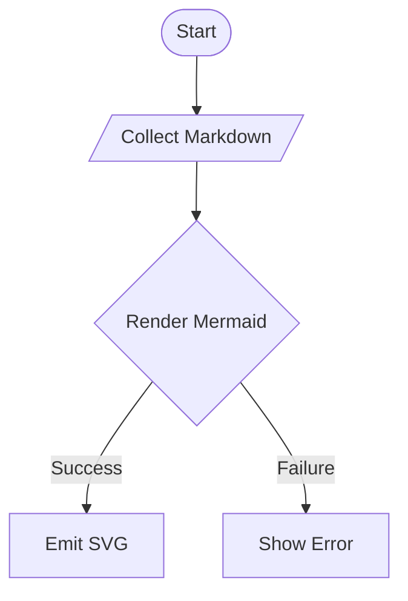
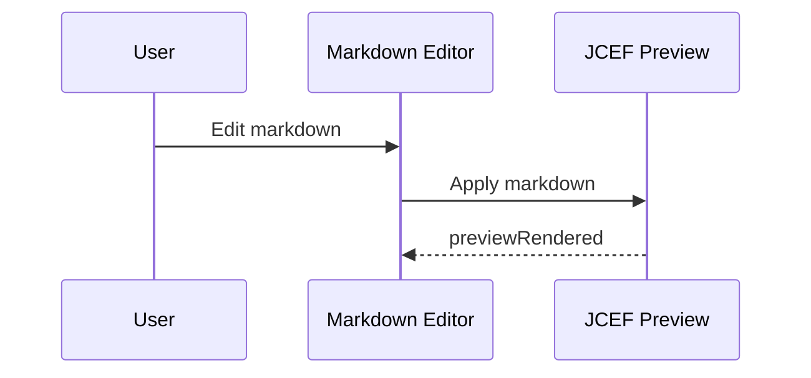
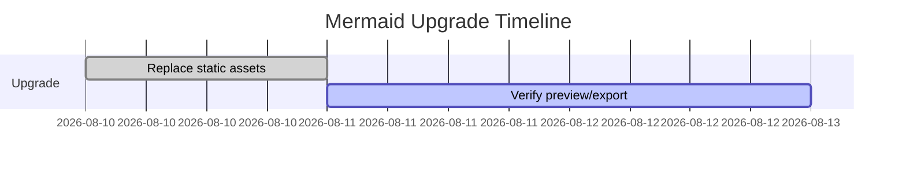
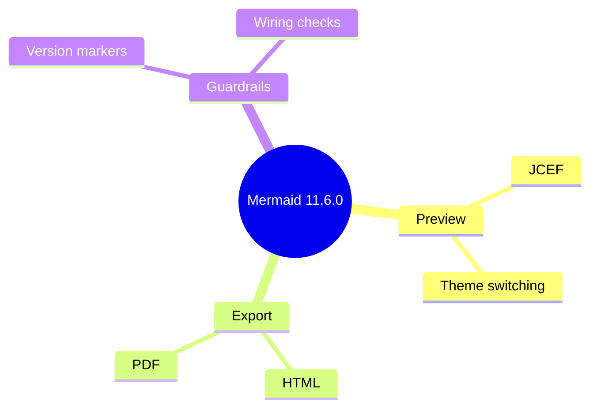
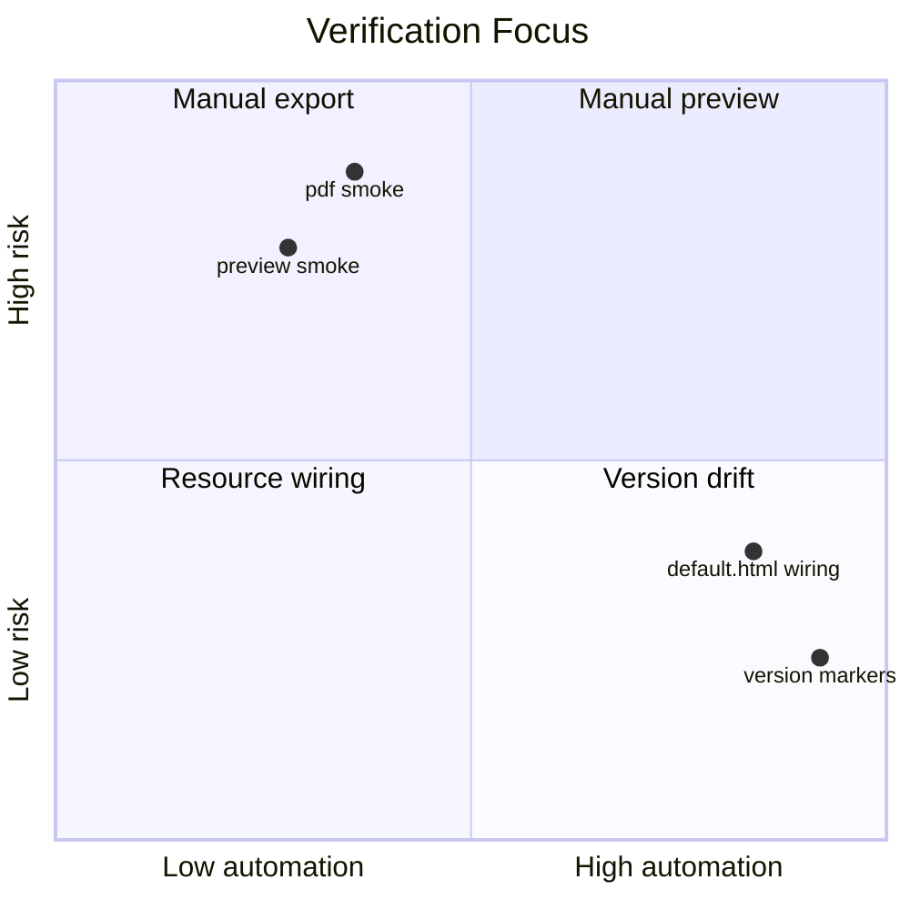

# Mermaid Upgrade Baseline

本文档用于 Mermaid 升级后的手工验收基线，覆盖预览、HTML 导出和 PDF 导出三条链路。

## Legacy Flowchart

```mermaid
flowchart TD
    Start([Start]) --> Input[/Collect Markdown/]
    Input --> Render{Render Mermaid}
    Render -->|Success| Svg[Emit SVG]
    Render -->|Failure| Error[Show Error]
```

## Legacy Sequence

```mermaid
sequenceDiagram
    participant User as User
    participant Plugin as Markdown Editor
    participant Preview as JCEF Preview
    User->>Plugin: Edit markdown
    Plugin->>Preview: Apply markdown
    Preview-->>Plugin: previewRendered
```

## Legacy Gantt

```mermaid
gantt
    title Mermaid Upgrade Timeline
    dateFormat  YYYY-MM-DD
    section Upgrade
    Replace static assets :done, a1, 2026-08-10, 1d
    Verify preview/export :active, a2, after a1, 2d
```

## Mindmap

```mermaid
mindmap
  root((Mermaid 11.6.0))
    Preview
      JCEF
      Theme switching
    Export
      HTML
      PDF
    Guardrails
      Version markers
      Wiring checks
```

## Quadrant Chart

```mermaid
quadrantChart
    title Verification Focus
    x-axis Low automation --> High automation
    y-axis Low risk --> High risk
    quadrant-1 Manual preview
    quadrant-2 Manual export
    quadrant-3 Resource wiring
    quadrant-4 Version drift
    "default.html wiring": [0.84, 0.38]
    "version markers": [0.92, 0.24]
    "preview smoke": [0.28, 0.78]
    "pdf smoke": [0.36, 0.88]
```
