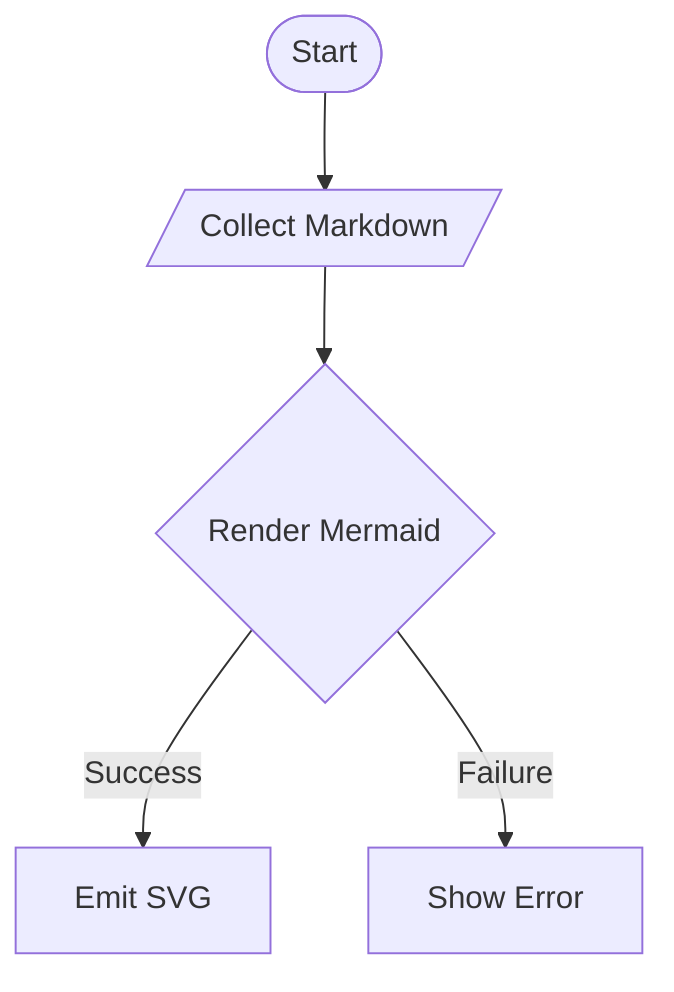
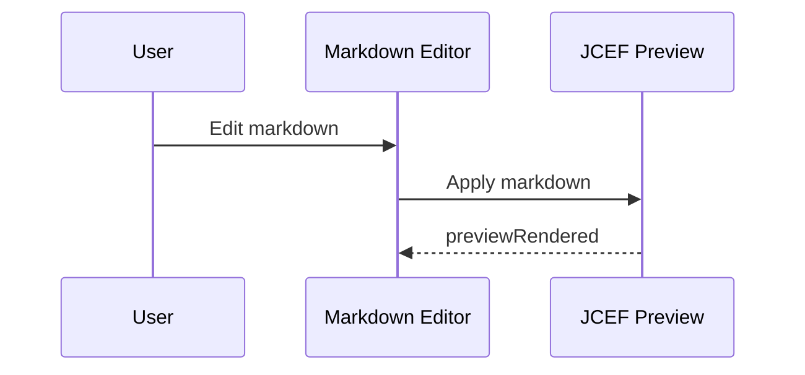
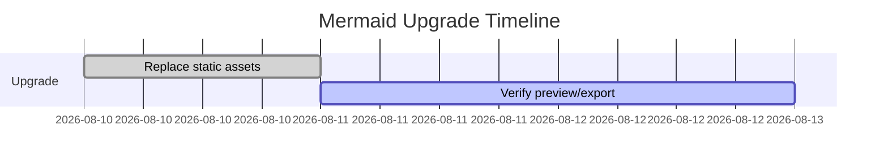
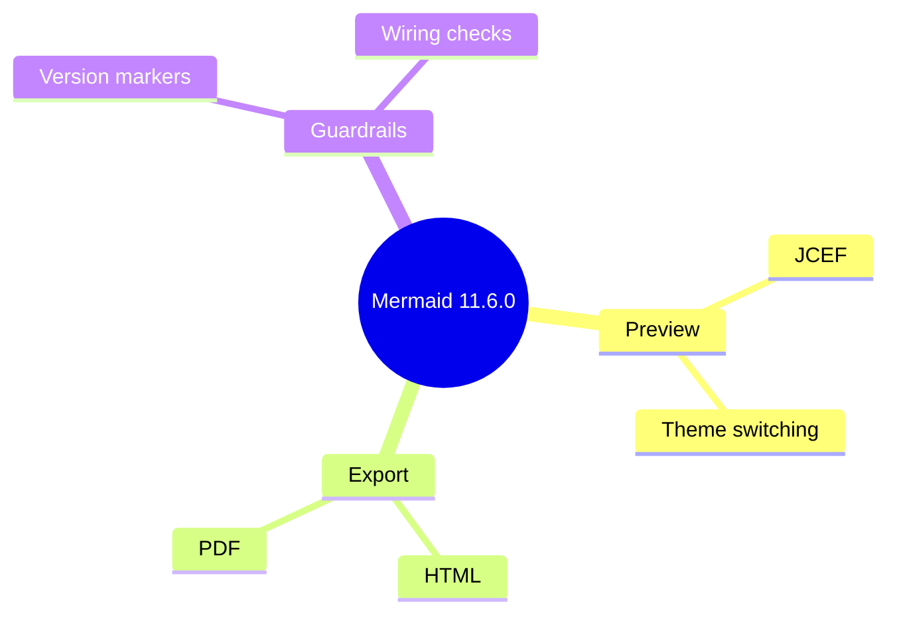
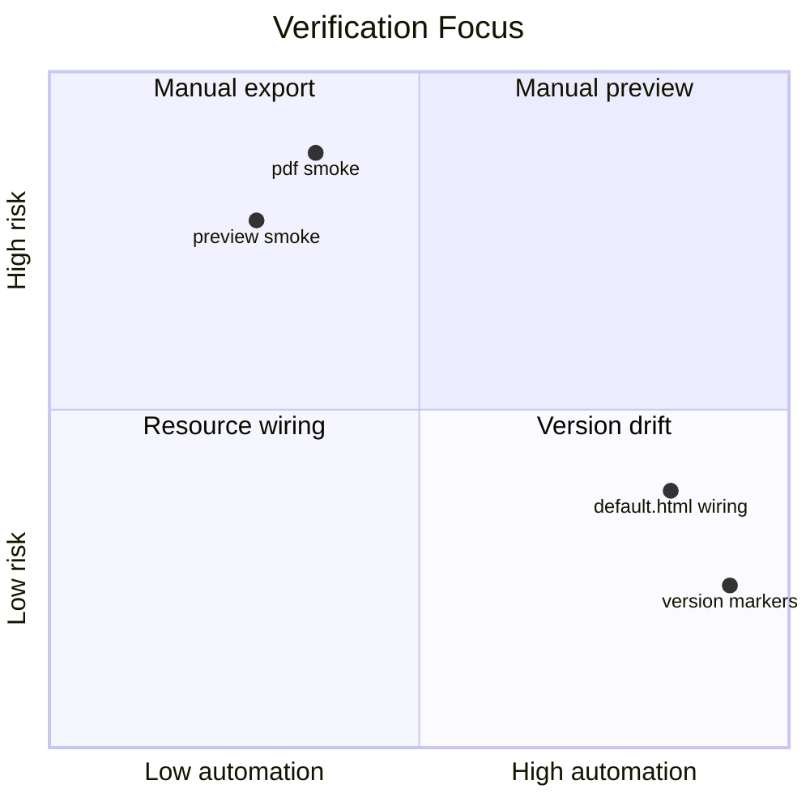
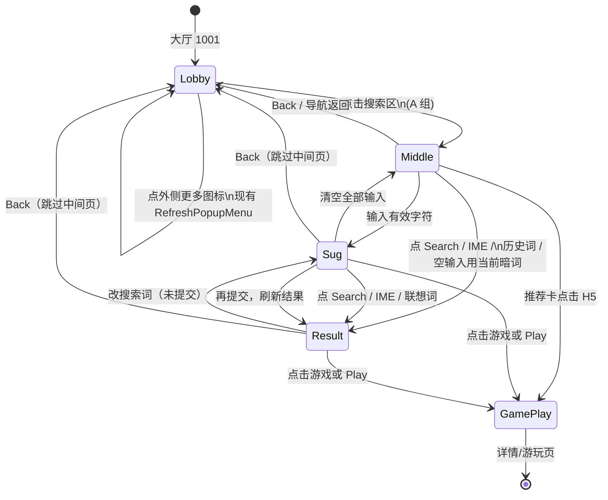
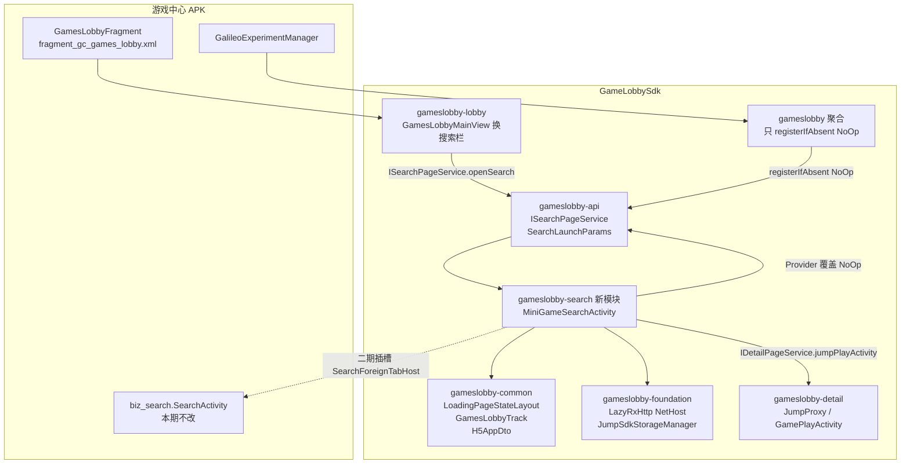

# Mermaid Upgrade Baseline

本文档用于 Mermaid 升级后的手工验收基线，覆盖预览、HTML 导出和 PDF 导出三条链路。

## Legacy Flowchart

## Legacy Sequence

## Legacy Gantt

## Mindmap

## Quadrant Chart

## Zoom Stress Flowchart

```mermaid
flowchart LR
    A[Zoom Stress Flowchart] --> B[Collect current preview DOM and async Mermaid render result]
    B --> C[Decorate .language-mermaid blocks without wrapping outer containers]
    C --> D[Inject top-right zoom trigger only after SVG render succeeds]
    D --> E[Open in-page floating viewer instead of resizing the whole IDE window]
    E --> F[Clone the original SVG so source mapping and export DOM stay untouched]
    F --> G[Provide zoom in, zoom out, reset and close actions in the viewer toolbar]
    G --> H[Handle mouse wheel zoom inside the viewer viewport with bounded scale]
    H --> I[Isolate viewer wheel, click and selection events from preview sync listeners]
    I --> J[Keep HTML export and PDF export output free of viewer-only DOM fragments]
```

## Label Wrap State Diagram

状态图转移标签里的 `\n` 必须拆成完整的两行，不能在标签框右缘被裁掉。

## Label Wrap Module Flowchart

多行节点和无空格边标签必须完整可见，对应搜索方案模块图里被裁切的标签。

